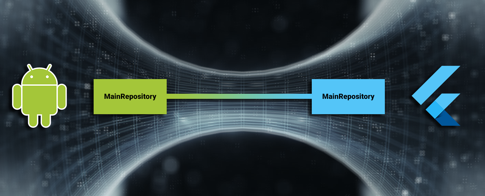
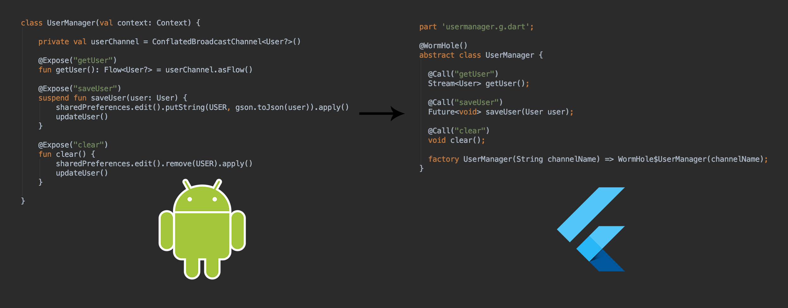

# WormHole

A WormHole is a speculative structure linking disparate points in spacetime.

In a mobile universe, a WormHole is a special solution of the Einstein field equations,
enabling to share platform classes to Flutter, and expose Flutter's classes to your native code.

[](https://www.github.com/florent37/WormHole)

# ShowCase

I want to add a Flutter view inside my existing Native project,
this screen needs to retrieve an user, and I use in my project `MainRepository`

I just have to expose my `MainRepository` to Flutter through a WormHole !

```kotlin
class MainRepository {
    @Expose("retrieveUser")
    suspend fun retrieveUser() : User {
        return myBDD.getUser()
    }
}

val mainRepository = MainRepository()
expose("user", mainRepository)
```

Can be retrieved in Flutter

```dart
@WormHole
abstract class MainRepository {
    @Call("retrieveUser")
    Future<User> retrieveUser();
    
    factory MainRepository(channelName) => WormHole$MainRepository;
}

final mainRepository = MainRepository("user");
User user = await mainRepository.retrieveUser();
```

# Import

WormHole depends on [`json_annotation`](https://pub.dev/packages/json_annotation) and needs a dart [`build_runner`](https://pub.dev/packages/build_runner) 
to run [`json_serializable`](https://pub.dev/packages/json_serializable) and *wormhole_generator*

```yaml
dependencies:
  flutter:
    sdk: flutter

  json_annotation: 3.0.0
  wormhole: 1.0.0

dev_dependencies:
  flutter_test:
    sdk: flutter
  build_runner: 1.7.2
  json_serializable: 3.2.3
  wormhole_generator: 1.0.0
```

## Expose on Native, Retrieve on Flutter

[](https://www.github.com/florent37/WormHole)

### Native

1. Add `@Expose("name")` on your method, specifying a method name
. For async methods, be sure they're implementing coroutine's `suspend`
. For observables results, be sure they're implementing coroutine's `Flow`

```kotlin
class UserManager(val context: Context) {

    companion object {
        const val USER = "user"
    }

    /**
     * For example, save an user as json into shared preferences
     * Can be a room database, etc.
     */
    private val gson = Gson()
    private val sharedPreferences = context.getSharedPreferences("user_shared", Context.MODE_PRIVATE)
    private val userChannel = ConflatedBroadcastChannel<User?>()

    init {
        updateUser()
    }

    private fun updateUser() {
        val currentUser = sharedPreferences.getString(USER, null)?.let {
            gson.fromJson(it, User::class.java)
        }
        userChannel.offer(currentUser)
    }

    /**
     * A stream exposing the current user
     */
    @Expose("getUser")
    fun getUser(): Flow<User?> = userChannel.asFlow()

    @Expose("saveUser")
    suspend fun saveUser(user: User) {
        sharedPreferences.edit().putString(USER, gson.toJson(user)).apply()
        updateUser()
    }

    @Expose("clear")
    fun clear() {
        sharedPreferences.edit().remove(USER).apply()
        updateUser()
    }
}
```

2. Expose this class to a Flutter's element
```kotlin
class MainActivity : FlutterActivity() {

    private val userManager by lazy { UserManager(this) }

    override fun onCreate(savedInstanceState: Bundle?) {
        super.onCreate(savedInstanceState)
        GeneratedPluginRegistrant.registerWith(this)

        /**
         * Expose the user manager to be accessible to Flutter via a WormHole
         */
        expose("user", userManager)
    }
}
```

### Flutter


```dart
@WormHole()
abstract class UserManager {

  @Call("getUser")
  Stream<User> getUser();

  @Call("saveUser")
  Future<void> saveUser(User user);

  @Call("clear")
  void clear();

  factory UserManager(channelName) => WormHole$UserManager(channelName);
}
```

1. Create an abstract class mirroring the Native's element
2. Annotate it with `@WormHole()`
3. For each Native's method, create a Dart method annotated with `@Call("methodname")`
. For async methods, be sure they're returning a `Future<type>`
. For observables results, be sure they're returining a `Stream<type>`
4. Create a factory, jumping to `WormHole$yourclass(channelName);`


```dart
final UserManager userManager = UserManager("user");
``` 

5. Then retrieve your native object from the WormHole

```dart
StreamBuilder(
    stream: userManager.getUser(),
    builder: (context, snapshot) {
       if (snapshot.hasData && snapshot.data != null) {
         final user = snapshot.data;
         ...
       }
    }
);
```

    final UserManager userManager = UserManager("user");
    await userManager.saveUser(User("the name");
    
    

And use it as an usual flutter class

## Expose on Flutter, Retrieve on Native

[](https://www.github.com/florent37/WormHole)

### Expose on Flutter

```dart
@WormHole() //A WormHole will be created arount this class
class QuestionBloc implements Bloc {

  //this method will be exposed to native through a WormHole, using the method name "ask"
  @Expose("ask")
  void ask(Question question) {
    //TODO your code here
  }
  
  expose(channelName) => WormHole$QuestionBloc(channelName).expose(this);
}
```

I want to expose this object through the wormhole named "question"

```dart
final bloc = QuestionBloc();
bloc.expose("question");
```

1. Add `@WormHole` annotation on your class
2. Add `@Expose("name")` on your method, specifying a method name
3. Add an expose method calling `WormHole$yourclass("channelName").expose(this)`
4. Expose your object using `.expose(channel)`

### Retrieve on native

```kotlin
interface QuestionBloc {
    @Call("ask")
    fun question(question: Question)
}
```

1. Create an interface, containing reflecting your Dart class `QuestionBloc`
2. For each @Expose method in Dart, create an @Call method, containing the same method name : `ask`

```kotlin
//retrieve the Flutter's QuestionBloc, in a FlutterActivity for example
val questionBloc = retrieve<QuestionBloc>("question")
```

3. Retrieve an object sent into the wormhole

```kotlin
questionBloc.ask(Question("what's your name"))
```

4. Your can now interact with your class 


# Flutter 

WormHole uses annotation processing to Expose/Retrieve Dart through WormHole

See [Generator](./generator/) for further explanations and configurations

# Android 

WormHole uses jvm reflection to Expose/Retrieve Java/Kotlin objects to be accessible through WormHole

See [WormHole-Android](./wormhole/)

# iOS

¯\\\__(ツ)\_/¯

WormHole is not available yet on iOS because : 

    - Annotation Processor does not exists in swift or ObjectiveC
    
    - Reflection on swift does not allow to perform needed actions
    
    - Swift (without ReactiveSwift) does not provides Futures / Streams
    
If someone in the community has an idea to port it, don't hesitate to make a pull request !
